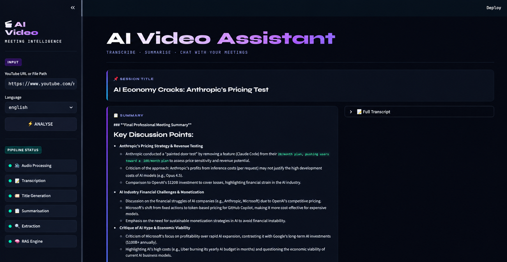

# 🎥 AI Video Assistant

> **Transcribe • Summarise • Extract Insights • Chat with Your Meetings**

AI Video Assistant is a GenAI-powered meeting intelligence application that converts YouTube videos or local audio/video files into **structured, searchable meeting knowledge**.

It processes the input through an end-to-end AI pipeline to generate a transcript, meeting title, summary, action items, key decisions, open questions, and a **RAG-powered chatbot** that lets users ask questions about the meeting.



---

## ✨ Features

- 🎙️ **Audio/Video Processing** — Accept YouTube URLs or local media files.
- 📝 **Automatic Transcription** — Converts spoken content into text.
- 🌐 **Language Support** — Supports English and Hinglish workflows.
- 🏷️ **AI Title Generation** — Creates a concise title from the transcript.
- 📋 **Meeting Summarisation** — Produces a structured summary of the discussion.
- ✅ **Action Item Extraction** — Identifies tasks and follow-ups mentioned in the meeting.
- 🔑 **Key Decision Extraction** — Extracts important decisions made during the discussion.
- ❓ **Open Question Extraction** — Identifies unresolved questions and topics.
- 🔎 **RAG-based Retrieval** — Indexes the transcript for semantic search.
- 💬 **Meeting Q&A** — Ask questions about the processed meeting and receive context-aware answers.
- 🖥️ **Interactive UI** — Displays pipeline status, summary, transcript, and meeting insights in one interface.

---

## 🧠 How It Works

The application follows a modular processing pipeline:

```text
YouTube URL / Local File
          │
          ▼
   Audio Processing
          │
          ▼
     Transcription
          │
          ▼
      Transcript
          │
    ┌─────┼──────────────┬───────────────┐
    ▼     ▼              ▼               ▼
  Title  Summary    Action Items    Key Decisions
    │     │              │               │
    └─────┴──────────────┴───────────────┘
                       │
                       ▼
                RAG / Vector Store
                       │
                       ▼
                 User Question
                       │
                       ▼
                Context Retrieval
                       │
                       ▼
                 AI-generated Answer
